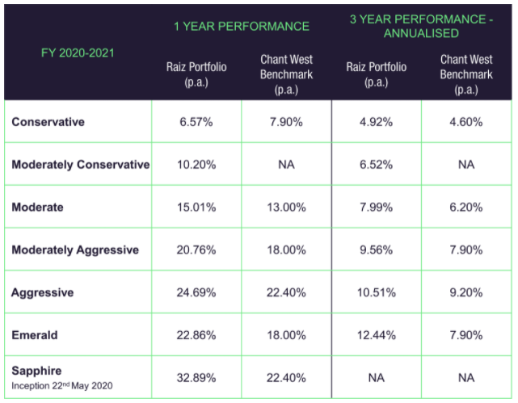

# Fintech Case Study    

    

## Overview and Background:

###  *Raiz Invest Limited*

* Raiz (ASX:RZI) was incorporated in 2016 and is based in Sydney, Australia.

* The company founder is George Lucas. 

* Since 2012, Sydney fund manager George Lucas has contemplated launching a micro-investing company in Australia. He joined forces with Acorns, a US company that gives first-time investors access to the markets by rounding up purchases to the closest dollar then investing the change in low-cost passive exchange-traded funds.

    

* The company is backed by institutional investors and has raised a total of 16 million in two funding rounds. Their most recent capital came from a post-IPO equity round on November 30, 2021.

## Business Activities:

* Raiz is a financial service that assists you in getting into the habit of saving and investing. They make it possible for Australians to start saving early, invest frequently, and achieve their financial goals. With the guidance of Nobel prize winner and creator of Modern Portfolio Theory, Dr Harry Markowitz, Raiz builds and optimises seven diversified portfolios. ETFs listed on the Australian Securities Exchange are used to build the portfolios. 

* Raiz pioneered micro-investing, allowing a new class of investors to participate. The platform is aimed at Gen Y and Z, which make up the largest generations currently in Australia's workforce.
    
    The Fund is for investors who want to invest in multi-asset portfolios for as little as $5.00; 

    have a diversified investment approach;

    are in their accumulation, pre-retirement, or retirement life stage;

    are looking for an investment product that provides options for low, medium, high, and very high risk and return trade-offs;

    and are looking to purchase an investment product through a direct online channel without receiving personal financial advice. 
    

* Raiz offers no account minimums, no commissions, and fractional investing all in your pocket. Raiz aims to make investing more accessible to everyone while also simplifying saving. 

* Raiz's investment platform has made micro-investing possible. The asset allocation is algorithmic, and the patented back-end technologies combine order processing and settlement activities, repopulating data via the cloud. Everything is kept on a remote server with bank-level security and data encryption.

## Landscape:

* Raiz is a micro-investment robo-advising fintech company. 

*   The popularity of automated investment platforms, sometimes known as robo-advisers, has skyrocketed in the recent decade. Investors who use these services answer a few questions regarding their risk tolerance,   savings goals, and time frame. They are given a portfolio that includes instructions on how often and how much they should contribute, as well as a visual representation of the chances of fulfilling their goals.

    The emergence of trustworthy, tested services has been hastened by the convergence of technology-led services and the growth of Australia's ETF market. In Australia, robo-advice has benefited from a lack of cheap expert guidance as well as a lack of financial diversification among many investors.

    The benefit of robo-advising investing is that it can be less than half the expense of seeing a traditional adviser and investing in actively managed funds.

    One of the essential aspects when choosing an investment provider is the low costs. The benefit of robo-advising investing is that it can be less than half the expense of seeing a traditional adviser and investing in actively managed funds.

* Other Australian companies involved in this domain are:
    
    [Stockspot](https://www.stockspot.com.au/) 

    [Six Park](https://www.sixpark.com.au/)

    [OpenInvest](https://www.openinvest.com.au/)

    [Spaceship Voyager](https://www.spaceship.com.au/voyager/)

    [Shareies](https://sharesies.com.au/)

    [InvestSMART](https://www.investsmart.com.au/)

    [Quiet Growth](https://www.quietgrowth.com.au/)

    [Pearler](https://pearler.com/)

## Results:

* Raiz has disrupted the financial industry due to its low costs, fractional investing and accessibility compared to traditional financial advisers. 

* Portfolio performance (after fees) is used to measure success and then comparing the results to an industry benchmark. Compared to the ASX index, robo advisors do not generally outperform the market as they are adjusted to your needs and risk tolerance with a percentage of defensive assets like bonds to reduce account volatility.

    

* Raiz has performed comparatively with similar products in this domain. 
    
    Stockspot performance table over the same period below. 

    

## Recommendations:

* Some products and services I would personally like that aren't currently offered by Raiz are: 

    Aside from ETFs, the ability to invest in other assets.

    An option to rebalance your portfolio to a defensive allocation if the market conditions deteriorate quickly. 

    Increased crypto exposure in portfolios. The current crypto portfolio (Saphire) only allocates 5% to Bitcoin. 

* I believe offering these products and services would give the user greater flexibility as they become a more experienced investor. 

* The above recommendations would require expanding existing back-office technology to access other assets, execution, monitoring and machine learning to refine the adjustments. 

* These technologies are suitable as they are only minor additions and upgrades to the current platform. 

## References:

Raiz Invest Limited (RZI.AX) company profile & facts – Yahoo Finance n.d., au.finance.yahoo.com, viewed 30 December 2021, <https://au.finance.yahoo.com/quote/RZI.AX/profile/>.

Raiz App n.d., viewed 30 December 2021, <https:www.raizinvest.com.au>.

Raiz (company) 2021, Wikipedia, viewed 30 December 2021, <https://en.wikipedia.org/wiki/Raiz_(company)>.

Crunchbase 2015, Crunchbase, viewed 1 January 2022, <https://www.crunchbase.com/organization/raiz-invest>.

Raiz founder prevails in boardroom row 2021, Australian Financial Review, viewed 1 January 2022, <https://www.afr.com/companies/financial-services/raiz-founder-prevails-in-boardroom-row-20210919-p58sww>.

4 robo adviser trends in 2022 that will help your future retirement 2021, www.morningstar.com, viewed 1 January 2022, <https://www.morningstar.com/news/marketwatch/20211220295/4-robo-adviser-trends-in-2022-that-will-help-your-future-retirement.>.

Brycki, C 2021, How Stockspot outperformed Vanguard and robo advisors, Stockspot Blog, viewed 2 January 2022, <https://blog.stockspot.com.au/best-robo-advisor/>.

5 of Australia’s Most Popular Robo-Advisors n.d., viewed 2 January 2022, <https://roboadvisors.com.au/australias-popular-robo-advisors/>.

Boring is the new black for online investors 2021, Australian Financial Review, viewed 2 January 2022, <https://www.afr.com/wealth/investing/boring-is-the-new-black-for-fintech-investors-20210409-p57hvi>.

Do Robo Advisors Beat The Market? Robo Advisor Performance Uncovered n.d., Liberated Stock Trader, viewed 3 January 2022, <https://www.liberatedstocktrader.com/do-robo-advisors-beat-the-market/>.

Raiz Portfolio Performance Financial Year 2020-21 2021, Raiz Invest, viewed 4 January 2022, <https://raizinvest.com.au/blog/raiz-portfolio-performance-financial-year-2020-21/>.

Australian Investing App Performance - WealthDiary n.d., viewed 4 January 2022, <https://wealthdiary.com.au/investing/performance/>.

